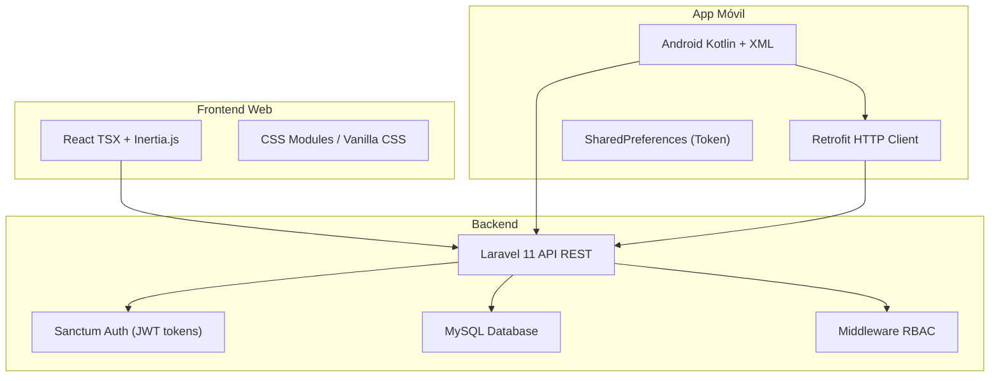
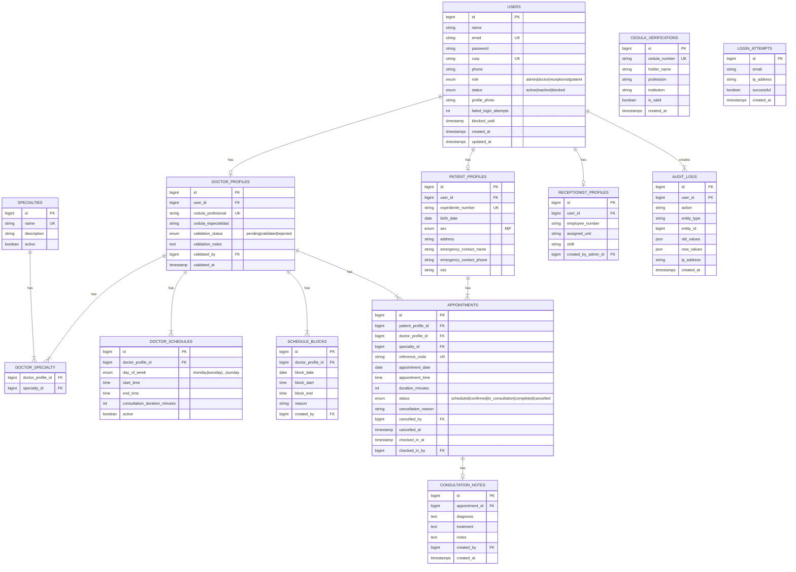
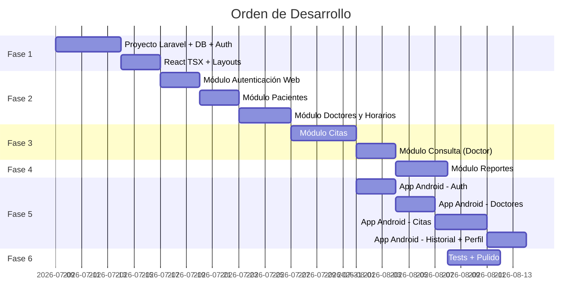

# Plan de Implementación — Sistema de Gestión de Citas Médicas

## Resumen del Proyecto

Sistema completo de gestión de citas médicas compuesto por:
- **Backend API REST**: Laravel 11 con MySQL
- **Frontend Web**: React TSX integrado con Laravel (Inertia.js)
- **App Móvil**: Android Studio con Kotlin + XML (Empty View Activities), consumiendo la API REST

El sistema gestiona el ciclo completo de una cita médica: registro de pacientes, configuración de doctores/horarios, agendamiento, consulta, diagnóstico y expediente clínico.

---

## User Review Required

> [!IMPORTANT]
> **Stack Técnico Confirmado**: Laravel 11 + MySQL + React TSX (vía Inertia.js) para el web, y Kotlin + XML en Android Studio para la app móvil. Se usará JWT (vía Laravel Sanctum) para autenticación tanto web como móvil.

> [!IMPORTANT]
> **Roles del Sistema**: Se implementarán exactamente 4 roles: **Paciente**, **Médico**, **Recepcionista** y **Administrador**. El Administrador tendrá control total sobre todo el sistema.

> [!WARNING]
> **Validación de Cédula Profesional**: Se implementará un servicio interno mock que simule la verificación de cédulas profesionales de la SEP dentro de nuestros propios servidores. No se consultará una API externa real.

> [!WARNING]
> **Funciones Omitidas**: Se omitirán las funciones de selfie/verificación facial y captura de INE mencionadas en el documento de registro. La verificación de identidad será únicamente por datos (CURP, cédula, correo, SMS mock).

---

## Open Questions

> [!IMPORTANT]
> **Nombre del proyecto Laravel**: ¿Deseas un nombre específico para el proyecto (ej. `medic-system`, `citas-medicas`)? Si no, usaré `medic-system`.

> [!IMPORTANT]
> **Notificaciones por correo**: ¿Se configurará un servicio de email real (SMTP/Mailtrap) o se usará el log driver de Laravel para simular los envíos de correo durante el desarrollo?

> [!IMPORTANT]
> **Exportación PDF/Excel**: El módulo de reportes requiere exportación en PDF y Excel. ¿Está bien usar las librerías `barryvdh/laravel-dompdf` para PDF y `maatwebsite/laravel-excel` para Excel?

---

## Arquitectura General



---

## Proposed Changes

El desarrollo se organizará en **6 fases** secuenciales. Cada fase tiene dependencias claras con la anterior.

---

### FASE 1: Fundación del Proyecto (Backend + Frontend Base)

Configuración inicial de Laravel, base de datos, sistema de autenticación y estructura React.

---

#### [NEW] Proyecto Laravel

Crear el proyecto Laravel con todas las dependencias necesarias.

##### Dependencias principales:
- `laravel/sanctum` — Autenticación API con tokens
- `inertiajs/inertia-laravel` — Integración React con Laravel
- `barryvdh/laravel-dompdf` — Generación PDF
- `maatwebsite/laravel-excel` — Exportación Excel
- `spatie/laravel-permission` — Sistema de roles y permisos RBAC

##### Dependencias frontend (npm):
- `@inertiajs/react` — Cliente Inertia para React
- `react`, `react-dom` — Framework UI
- `@types/react`, `@types/react-dom` — Tipos TypeScript
- `typescript` — Soporte TSX

---

#### [NEW] Base de Datos — Migraciones

Estructura completa de la base de datos MySQL:

```
database/migrations/
├── create_users_table.php
├── create_specialties_table.php
├── create_doctor_profiles_table.php
├── create_patient_profiles_table.php
├── create_receptionist_profiles_table.php
├── create_doctor_specialties_table.php          (pivot)
├── create_doctor_schedules_table.php
├── create_schedule_blocks_table.php
├── create_appointments_table.php
├── create_medical_records_table.php
├── create_consultation_notes_table.php
├── create_audit_logs_table.php
├── create_cedula_verifications_table.php         (mock SEP)
├── create_password_reset_tokens_table.php
└── create_login_attempts_table.php
```

##### Diagrama Entidad-Relación:



---

#### [NEW] Modelos Eloquent

```
app/Models/
├── User.php
├── Specialty.php
├── DoctorProfile.php
├── PatientProfile.php
├── ReceptionistProfile.php
├── DoctorSchedule.php
├── ScheduleBlock.php
├── Appointment.php
├── ConsultationNote.php
├── AuditLog.php
├── CedulaVerification.php
└── LoginAttempt.php
```

Cada modelo incluirá:
- Relaciones Eloquent completas (`hasOne`, `hasMany`, `belongsTo`, `belongsToMany`)
- `$fillable` / `$casts` apropiados

---

#### [NEW] Seeder

```
database/seeders/
├── DatabaseSeeder.php
└── AdminUserSeeder.php              (usuario administrador inicial — necesario para poder ingresar al sistema)
```

---

#### [NEW] Sistema de Autenticación

```
app/Http/Controllers/Auth/
├── LoginController.php              (login web + API, bloqueo tras 5 intentos)
├── RegisterController.php           (registro público: paciente y médico)
├── ForgotPasswordController.php     (recuperación por email)
├── ResetPasswordController.php      (reset con token)
└── LogoutController.php             (invalidación de token)
```

```
app/Http/Middleware/
├── RoleMiddleware.php               (verificación de rol por ruta)
├── CheckAccountStatus.php           (verificar si cuenta está activa/bloqueada)
└── AuditLogMiddleware.php           (registro automático de acciones sensibles)
```

##### Lógica de Registro por Rol:

| Rol | Flujo de Registro |
|---|---|
| **Paciente** | Auto-registro público. Valida formato CURP, crea usuario + perfil paciente + expediente automático. |
| **Médico** | Auto-registro público con validación. Ingresa CURP + cédula → el sistema verifica contra la tabla `cedula_verifications` (mock SEP). Cuenta queda en estado `pending` hasta que el admin la apruebe. |
| **Recepcionista** | Solo el Administrador puede crear cuentas. Se envía invitación por email para establecer contraseña. |
| **Administrador** | Solo puede ser creado por otro Administrador o vía seeder inicial. |

---

#### [NEW] Estructura React TSX + Inertia.js

```
resources/js/
├── app.tsx                          (entry point Inertia)
├── types/
│   ├── index.d.ts                   (tipos globales)
│   ├── models.ts                    (interfaces: User, Doctor, Patient, etc.)
│   └── enums.ts                     (AppointmentStatus, UserRole, etc.)
├── Layouts/
│   ├── AuthenticatedLayout.tsx      (layout principal con sidebar)
│   ├── GuestLayout.tsx              (layout para login/registro)
│   └── Sidebar.tsx                  (navegación según rol)
├── Components/
│   ├── ui/                          (botones, inputs, modals, cards, tables)
│   ├── Calendar/                    (componente calendario de citas)
│   ├── DataTable/                   (tabla con búsqueda, paginación, filtros)
│   └── Charts/                      (gráficas para reportes)
├── Pages/
│   ├── Auth/
│   │   ├── Login.tsx
│   │   ├── Register.tsx
│   │   ├── ForgotPassword.tsx
│   │   └── ResetPassword.tsx
│   ├── Dashboard/
│   │   └── Index.tsx                (dashboard según rol)
│   ├── Patients/                    (CRUD pacientes - admin/recepcionista)
│   ├── Doctors/                     (CRUD doctores - admin)
│   ├── Schedules/                   (gestión horarios - admin)
│   ├── Appointments/                (gestión citas - recepcionista)
│   ├── Consultation/                (vista consulta - doctor)
│   ├── Reports/                     (reportes - admin)
│   └── Profile/                     (perfil usuario)
└── hooks/
    ├── useAuth.ts
    ├── usePermissions.ts
    └── useFilters.ts
```

```
resources/css/
├── app.css                          (estilos globales, variables CSS, tema)
├── components/                      (estilos por componente)
├── layouts/                         (estilos de layouts)
└── pages/                           (estilos específicos por página)
```

---

### FASE 2: Módulos Web Core (Módulos 1-3)

Implementación de los módulos de autenticación, gestión de pacientes, y gestión de doctores/horarios.

---

#### [NEW] Módulo 1 — Autenticación y Control de Acceso

##### Controladores API:
```
app/Http/Controllers/Api/
├── AuthController.php
```

##### Páginas React:
```
resources/js/Pages/Auth/
├── Login.tsx                        (formulario login con validación)
├── Register.tsx                     (registro paciente/médico con flujo diferenciado)
├── ForgotPassword.tsx               (solicitar reset)
└── ResetPassword.tsx                (establecer nueva contraseña)
```

##### Funcionalidades:
- Login con email + contraseña → genera token Sanctum
- Registro paciente: nombre, fecha nacimiento, CURP, sexo, correo, contraseña
- Registro médico: nombre, CURP, cédula profesional, especialidad, correo, contraseña → validación contra mock SEP → estado `pending`
- Bloqueo temporal tras 5 intentos fallidos (15 minutos)
- Recuperación de contraseña por email con token temporal
- Middleware de rol en todas las rutas protegidas
- Logout con invalidación de token

---

#### [NEW] Módulo 2 — Gestión de Pacientes

##### Controladores:
```
app/Http/Controllers/
├── PatientController.php            (CRUD completo)
```

##### Form Requests:
```
app/Http/Requests/
├── StorePatientRequest.php
├── UpdatePatientRequest.php
```

##### Páginas React:
```
resources/js/Pages/Patients/
├── Index.tsx                        (listado con búsqueda por nombre/CURP/expediente)
├── Create.tsx                       (formulario registro nuevo paciente)
├── Show.tsx                         (perfil completo + historial citas + diagnósticos)
└── Edit.tsx                         (editar datos personales)
```

##### Funcionalidades:
- Accesible por: **Administrador** y **Recepcionista**
- Búsqueda por nombre, CURP o número de expediente
- Número de expediente auto-generado (formato: `EXP-YYYYMMDD-XXXX`)
- CURP único en el sistema (validación de formato mexicano)
- Desactivación de paciente (soft delete, no elimina historial)
- Restricción: no se puede desactivar paciente con citas activas pendientes

---

#### [NEW] Módulo 3 — Gestión de Doctores y Horarios

##### Controladores:
```
app/Http/Controllers/
├── DoctorController.php             (CRUD doctores)
├── DoctorScheduleController.php     (gestión de horarios semanales)
├── ScheduleBlockController.php      (bloqueo de horarios)
```

##### Páginas React:
```
resources/js/Pages/Doctors/
├── Index.tsx                        (listado con filtro por especialidad/disponibilidad)
├── Create.tsx                       (registro doctor + asignar especialidades)
├── Show.tsx                         (detalle doctor + horarios + agenda)
└── Edit.tsx                         (editar info y especialidades)

resources/js/Pages/Schedules/
├── DoctorSchedule.tsx               (configurar horario semanal)
├── ScheduleBlocks.tsx               (gestionar bloqueos/vacaciones)
└── AvailabilityCalendar.tsx         (vista calendario disponibilidad)
```

##### Funcionalidades:
- Accesible por: **Administrador** (CRUD completo), **Doctor** (ver su propia info)
- Asignar múltiples especialidades (relación many-to-many)
- Horario semanal: día, hora inicio, hora fin, duración consulta
- Validación: no permite horarios solapados para el mismo doctor
- Bloqueo de fechas/horarios con alerta si hay citas ya agendadas
- Listado filtrable por especialidad y disponibilidad

---

### FASE 3: Módulo Central de Citas y Consultas (Módulo 4)

---

#### [NEW] Módulo 4 — Gestión de Citas

##### Controladores:
```
app/Http/Controllers/
├── AppointmentController.php        (CRUD citas)
├── AppointmentCheckInController.php (check-in de pacientes)
├── AvailabilityController.php       (consulta slots disponibles)
```

##### Services:
```
app/Services/
├── AppointmentService.php           (lógica de negocio: validaciones, conflictos)
├── AvailabilityService.php          (cálculo de slots disponibles)
└── ReferenceCodeService.php         (generación códigos de referencia únicos)
```

##### Páginas React:
```
resources/js/Pages/Appointments/
├── Index.tsx                        (calendario de citas: día/semana/mes)
├── Create.tsx                       (agendar cita: seleccionar paciente → doctor → slot)
├── Show.tsx                         (detalle de cita con acciones)
├── Reschedule.tsx                   (reprogramar cita)
└── DailyAgenda.tsx                  (agenda del día con check-in)
```

```
resources/js/Pages/Consultation/
├── Index.tsx                        (lista de pacientes del día - vista doctor)
├── ConsultationRoom.tsx             (registrar diagnóstico + tratamiento)
└── PatientHistory.tsx               (expediente del paciente en consulta)
```

##### Funcionalidades:
- **Recepcionista**: agendar, reprogramar, cancelar citas, check-in
- **Doctor**: ver su agenda del día, iniciar consulta, registrar diagnóstico/tratamiento
- **Administrador**: acceso completo a todas las funciones
- Calendario visual por doctor/especialidad (día, semana, mes)
- Código de referencia único por cita (formato: `CITA-XXXXXX`)
- Estados: `scheduled` → `confirmed` → `in_consultation` → `completed` / `cancelled`
- Cancelación con registro de motivo, usuario y timestamp
- Check-in del paciente el día de la cita
- Validaciones:
  - No duplicar citas en el mismo slot
  - Solo agendar dentro de horarios disponibles del doctor
  - No agendar en horarios bloqueados

---

### FASE 4: Reportes (Módulo 5)

---

#### [NEW] Módulo 5 — Reportes y Estadísticas

##### Controladores:
```
app/Http/Controllers/
├── ReportController.php             (generación de reportes)
├── ExportController.php             (exportación PDF/Excel)
```

##### Páginas React:
```
resources/js/Pages/Reports/
├── Index.tsx                        (dashboard de reportes con gráficas)
├── AppointmentReport.tsx            (reporte de citas por período)
├── DoctorReport.tsx                 (doctores con más consultas)
├── SpecialtyReport.tsx              (especialidades más demandadas)
├── PatientReport.tsx                (pacientes con más visitas)
└── DailySummary.tsx                 (resumen diario del flujo de citas)
```

##### Funcionalidades:
- Accesible por: **Administrador** únicamente
- Filtros por rango de fechas, doctor, especialidad
- Gráficas interactivas (barras, pie, líneas)
- Exportación PDF (DomPDF) y Excel (Maatwebsite)
- Resumen diario con estado de cada cita
- Queries optimizadas para no afectar rendimiento

---

### FASE 5: Aplicación Móvil Android (Módulos 6-11)

---

#### [NEW] Estructura del Proyecto Android

```
app/src/main/
├── java/com/medicsystem/
│   ├── MedicSystemApp.kt                (Application class)
│   ├── data/
│   │   ├── api/
│   │   │   ├── ApiService.kt            (interfaz Retrofit)
│   │   │   ├── RetrofitClient.kt        (configuración HTTP)
│   │   │   └── AuthInterceptor.kt       (inyección token en headers)
│   │   ├── models/
│   │   │   ├── User.kt
│   │   │   ├── Doctor.kt
│   │   │   ├── Appointment.kt
│   │   │   ├── ConsultationNote.kt
│   │   │   ├── Specialty.kt
│   │   │   └── ApiResponse.kt           (wrapper genérico de respuestas)
│   │   ├── repository/
│   │   │   ├── AuthRepository.kt
│   │   │   ├── DoctorRepository.kt
│   │   │   ├── AppointmentRepository.kt
│   │   │   └── ProfileRepository.kt
│   │   └── preferences/
│   │       └── SessionManager.kt        (SharedPreferences para token)
│   ├── ui/
│   │   ├── auth/
│   │   │   ├── LoginActivity.kt
│   │   │   ├── RegisterActivity.kt
│   │   │   ├── ForgotPasswordActivity.kt
│   │   │   └── xml: activity_login.xml, activity_register.xml, activity_forgot_password.xml
│   │   ├── home/
│   │   │   ├── HomeActivity.kt          (bottom navigation host)
│   │   │   └── xml: activity_home.xml
│   │   ├── doctors/
│   │   │   ├── DoctorListActivity.kt
│   │   │   ├── DoctorDetailActivity.kt
│   │   │   ├── DoctorAdapter.kt         (RecyclerView adapter)
│   │   │   └── xml: activity_doctor_list.xml, activity_doctor_detail.xml, item_doctor.xml
│   │   ├── appointments/
│   │   │   ├── BookAppointmentActivity.kt    (flujo paso a paso)
│   │   │   ├── SelectDateTimeActivity.kt
│   │   │   ├── ConfirmAppointmentActivity.kt
│   │   │   ├── MyAppointmentsActivity.kt
│   │   │   ├── AppointmentDetailActivity.kt
│   │   │   ├── AppointmentAdapter.kt
│   │   │   └── xml: correspondientes
│   │   ├── history/
│   │   │   ├── MedicalHistoryActivity.kt
│   │   │   ├── ConsultationDetailActivity.kt
│   │   │   ├── HistoryAdapter.kt
│   │   │   └── xml: correspondientes
│   │   ├── profile/
│   │   │   ├── ProfileActivity.kt
│   │   │   ├── EditProfileActivity.kt
│   │   │   ├── ChangePasswordActivity.kt
│   │   │   └── xml: correspondientes
│   │   └── common/
│   │       ├── BaseActivity.kt          (clase base con manejo de errores)
│   │       └── LoadingDialog.kt
│   └── utils/
│       ├── Constants.kt                 (URLs, claves)
│       ├── Extensions.kt               (extensiones Kotlin útiles)
│       ├── Validators.kt               (validación CURP, email, etc.)
│       └── DateUtils.kt                (formateo de fechas)
├── res/
│   ├── layout/                          (todos los XML de actividades)
│   ├── values/
│   │   ├── strings.xml                  (textos en español)
│   │   ├── colors.xml                   (paleta de colores del sistema)
│   │   ├── themes.xml                   (tema Material Design)
│   │   └── dimens.xml                   (dimensiones consistentes)
│   ├── drawable/                        (íconos, fondos, shapes)
│   ├── menu/                            (bottom navigation menu)
│   └── navigation/                      (si se usa Navigation Component)
└── AndroidManifest.xml
```

##### Dependencias Android (build.gradle):
- `com.squareup.retrofit2:retrofit` — Cliente HTTP
- `com.squareup.retrofit2:converter-gson` — Serialización JSON
- `com.squareup.okhttp3:logging-interceptor` — Debug de requests
- `com.google.android.material:material` — Material Design Components
- `androidx.recyclerview:recyclerview` — Listas
- `de.hdodenhof:circleimageview` — Imágenes circulares perfil
- `com.github.bumptech.glide:glide` — Carga de imágenes

---

#### [NEW] Módulo 6 — Autenticación Móvil

- `LoginActivity.kt` + `activity_login.xml` — Login con email + contraseña
- `RegisterActivity.kt` + `activity_register.xml` — Registro paciente (nombre, fecha nacimiento, CURP, correo, contraseña)
- `ForgotPasswordActivity.kt` + `activity_forgot_password.xml` — Recuperación por email
- Validación en tiempo real de campos (formato CURP, email, longitud contraseña)
- Token almacenado en `SharedPreferences` (encriptado con `EncryptedSharedPreferences`)
- Sesión persistente entre cierres de la app
- Logout desde perfil con limpieza de token

---

#### [NEW] Módulo 7 — Búsqueda de Doctores

- `DoctorListActivity.kt` — Listado de doctores con RecyclerView
- `DoctorDetailActivity.kt` — Detalle: nombre, especialidad, cédula, horarios
- Búsqueda por nombre o especialidad
- Filtro por disponibilidad (hoy, esta semana)
- Ordenamiento por disponibilidad más próxima
- Calendario visual de slots disponibles
- No mostrar horarios bloqueados

---

#### [NEW] Módulo 8 — Agendamiento de Citas

- Flujo paso a paso: Doctor → Fecha → Hora → Confirmación
- `SelectDateTimeActivity.kt` — Selección de fecha y hora con slots disponibles
- `ConfirmAppointmentActivity.kt` — Resumen antes de confirmar
- Código de referencia generado por el backend
- Cancelación con restricción de 2 horas mínimo antes de la cita
- No permitir más de una cita activa con el mismo doctor el mismo día
- Email de confirmación enviado por el backend

---

#### [NEW] Módulo 9 — Mis Citas

- `MyAppointmentsActivity.kt` — Lista de citas próximas + historial
- `AppointmentDetailActivity.kt` — Detalle con código de referencia
- Indicadores visuales por estado (colores/íconos diferenciados)
- Citas del día destacadas al inicio
- Citas canceladas con etiqueta visual diferenciada, sin interacción
- Opción de cancelar desde la lista (si cumple restricción de 2 horas)

---

#### [NEW] Módulo 10 — Historial Médico

- `MedicalHistoryActivity.kt` — Lista de consultas completadas
- `ConsultationDetailActivity.kt` — Detalle: diagnóstico + tratamiento
- Filtro por doctor o rango de fechas
- Solo lectura (paciente no puede editar)
- Solo consultas con estado `completed` y diagnóstico registrado

---

#### [NEW] Módulo 11 — Perfil del Paciente

- `ProfileActivity.kt` — Ver datos: nombre, nacimiento, CURP, correo, teléfono
- `EditProfileActivity.kt` — Editar teléfono y foto de perfil
- `ChangePasswordActivity.kt` — Cambio de contraseña (requiere contraseña actual)
- Resumen de actividad: total citas realizadas + próxima cita
- Botón de cerrar sesión

---

### FASE 6: Rutas API, Pruebas y Pulido Final

---

#### [NEW] Rutas API REST

```
routes/api.php
```

##### Estructura de rutas:

```
POST   /api/auth/login
POST   /api/auth/register
POST   /api/auth/forgot-password
POST   /api/auth/reset-password
POST   /api/auth/logout

# Pacientes (admin, recepcionista)
GET    /api/patients
POST   /api/patients
GET    /api/patients/{id}
PUT    /api/patients/{id}
PATCH  /api/patients/{id}/deactivate

# Doctores (admin)
GET    /api/doctors
POST   /api/doctors
GET    /api/doctors/{id}
PUT    /api/doctors/{id}
GET    /api/doctors/{id}/availability?date=YYYY-MM-DD
PATCH  /api/doctors/{id}/validate

# Especialidades
GET    /api/specialties

# Horarios (admin)
GET    /api/doctors/{id}/schedules
POST   /api/doctors/{id}/schedules
PUT    /api/schedules/{id}
DELETE /api/schedules/{id}

# Bloqueos (admin)
POST   /api/doctors/{id}/blocks
DELETE /api/blocks/{id}

# Citas (recepcionista, paciente vía móvil)
GET    /api/appointments
POST   /api/appointments
GET    /api/appointments/{id}
PUT    /api/appointments/{id}/reschedule
PATCH  /api/appointments/{id}/cancel
PATCH  /api/appointments/{id}/check-in
PATCH  /api/appointments/{id}/start-consultation
PATCH  /api/appointments/{id}/complete

# Notas de consulta (doctor)
POST   /api/appointments/{id}/consultation-notes
GET    /api/appointments/{id}/consultation-notes

# Mis citas (paciente móvil)
GET    /api/my/appointments
GET    /api/my/appointments/{id}
POST   /api/my/appointments
PATCH  /api/my/appointments/{id}/cancel

# Mi historial médico (paciente móvil)
GET    /api/my/medical-history
GET    /api/my/medical-history/{id}

# Mi perfil (paciente móvil)
GET    /api/my/profile
PUT    /api/my/profile
POST   /api/my/profile/change-password
POST   /api/my/profile/photo

# Reportes (admin)
GET    /api/reports/appointments
GET    /api/reports/doctors
GET    /api/reports/specialties
GET    /api/reports/patients
GET    /api/reports/daily-summary
GET    /api/reports/export/{type}
```

---

#### [NEW] Validación Mock de Cédula Profesional (SEP interna)

```
app/Services/CedulaVerificationService.php
```

- Tabla `cedula_verifications` pre-poblada manualmente desde el panel de admin
- El servicio busca la cédula en la tabla local
- Verifica que el nombre coincida
- Devuelve: válida/inválida + datos del profesionista

---

#### [NEW] Notifications y Emails

```
app/Notifications/
├── AppointmentConfirmed.php
├── AppointmentCancelled.php
├── AppointmentReminder.php
├── PasswordResetNotification.php
├── AccountCreatedNotification.php       (para recepcionistas invitadas)
└── DoctorValidatedNotification.php
```

```
app/Mail/
├── AppointmentConfirmationMail.php
├── PasswordResetMail.php
└── InvitationMail.php
```

---

#### [NEW] Tests

```
tests/
├── Feature/
│   ├── Auth/
│   │   ├── LoginTest.php
│   │   ├── RegisterTest.php
│   │   └── PasswordResetTest.php
│   ├── Patient/
│   │   ├── PatientCrudTest.php
│   │   └── PatientSearchTest.php
│   ├── Doctor/
│   │   ├── DoctorCrudTest.php
│   │   └── ScheduleTest.php
│   ├── Appointment/
│   │   ├── BookingTest.php
│   │   ├── CancellationTest.php
│   │   └── AvailabilityTest.php
│   └── Report/
│       └── ReportGenerationTest.php
└── Unit/
    ├── AvailabilityServiceTest.php
    ├── ReferenceCodeServiceTest.php
    └── CedulaVerificationServiceTest.php
```

---

## Permisos por Rol (Matriz RBAC)

| Funcionalidad | Admin | Doctor | Recepcionista | Paciente (Móvil) |
|---|:---:|:---:|:---:|:---:|
| Gestionar usuarios/roles | ✅ | ❌ | ❌ | ❌ |
| CRUD Pacientes | ✅ | ❌ | ✅ | ❌ |
| CRUD Doctores | ✅ | ❌ | ❌ | ❌ |
| Validar médicos (cédula) | ✅ | ❌ | ❌ | ❌ |
| Configurar horarios | ✅ | ❌ | ❌ | ❌ |
| Agendar citas (cualquier paciente) | ✅ | ❌ | ✅ | ❌ |
| Agendar citas (propias) | ❌ | ❌ | ❌ | ✅ |
| Check-in pacientes | ✅ | ❌ | ✅ | ❌ |
| Ver agenda propia | ❌ | ✅ | ❌ | ✅ |
| Registrar diagnóstico/tratamiento | ❌ | ✅ | ❌ | ❌ |
| Ver expediente clínico completo | ✅ | ✅ (sus pacientes) | ❌ | ✅ (propio, solo lectura) |
| Ver reportes | ✅ | ❌ | ❌ | ❌ |
| Exportar reportes | ✅ | ❌ | ❌ | ❌ |
| Crear recepcionistas | ✅ | ❌ | ❌ | ❌ |
| Editar perfil propio | ✅ | ✅ | ✅ | ✅ |

---

## Verification Plan

### Automated Tests
```bash
# Ejecutar todos los tests de Laravel
php artisan test

# Tests específicos por módulo
php artisan test --filter=LoginTest
php artisan test --filter=AppointmentTest
php artisan test --filter=AvailabilityServiceTest

# Verificar migraciones
 php artisan migrate:fresh --seed  # solo corre AdminUserSeeder
```

### Manual Verification
- Probar todos los endpoints API con Postman (se incluirá colección)
- Verificar flujo completo web: login → agendar cita → consulta → diagnóstico
- Verificar flujo completo móvil: registro → buscar doctor → agendar → ver historial
- Validar permisos: intentar acceder a rutas restringidas con roles incorrectos
- Validar bloqueo de cuenta tras 5 intentos fallidos
- Verificar generación de reportes PDF/Excel
- Probar en dispositivo Android físico o emulador (API 26+)

---

## Orden de Ejecución



---

*Plan generado para el Sistema de Gestión de Citas Médicas — Stack: Laravel 11 + MySQL + React TSX + Android Kotlin*
